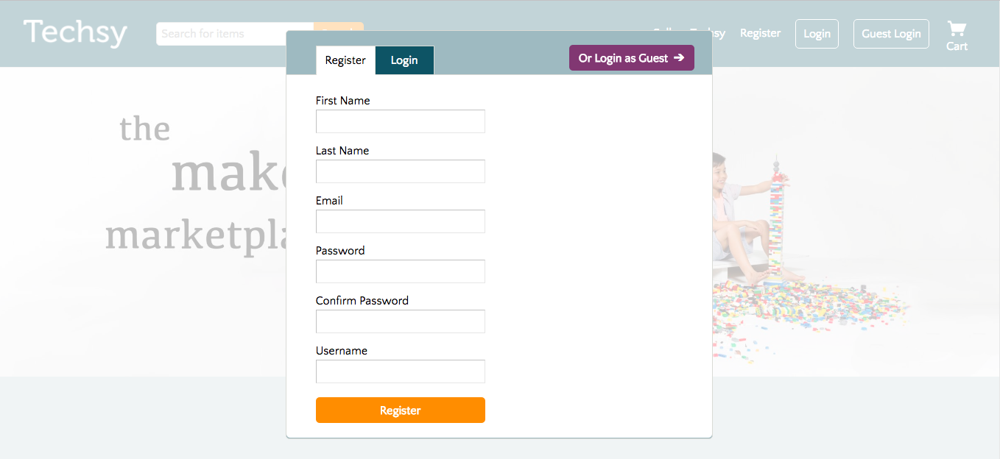

# Techsy

[Techsy live][heroku] **NB:** This should be a link to your production site

[heroku]: http://www.techsy.store

Techsy is a full-stack web application inspired by Etsy.  It utilizes Ruby on Rails on the backend, a PostgreSQL database, and React.js with a Redux architectural framework on the frontend.  

## Features & Implementation

### Single-Page App

Techsy is a single-page; all content is delivered on one static page. Each React component has a container (or a parent with a container), which delivers the appropriate state information to the component so that it renders . The Store part of the Redux structure holds the current state divided into `cart`, `listing`, `listings`, `modals`, `search`, `session`, and `shop`.

### Session and Modal

Techsy has a full authentication system that keeps sensitive information, such as the user's password, protected. The `User` model validates the password length before encrypting the password with BCrypt and storing the result in the database. Each user is also initialized with a session token. This session token is reset when the user logs in or logs out, and the session cookie is updated to reflect the session token of the current user. The rest of application can access this current user via the `current_user` helper method.

```Ruby
class User < ActiveRecord::Base
  attr_reader :password

  validates :username, :password_digest, :session_token, :email, presence: true
  validates :username, :session_token, :email, uniqueness: true
  validates :password, length: { minimum: 6, allow_nil: true }

  after_initialize :ensure_session_token

  def self.find_by_credentials(username, password)
    user = User.find_by(username: username)
    return nil unless user && user.is_password?(password)
    user
  end

  def password=(password)
    @password = password
    self.password_digest = BCrypt::Password.create(password)
  end

  def is_password?(password)
    pw_digest = BCrypt::Password.new(self.password_digest)
    pw_digest.is_password?(password)
  end
end

On the frontend, the user can register or login via a Session Modal for a professional look.



```

### Listings and Search

Listings are stored in one table in the database that keeps track of `shop_id`, `title`, `subtitle`, `description`, `image_url`, `price`, and `quantity`. When the current user visits a page with many listings, the frontend API uses an AJAX call to fetch the appropriate set of listings. This call sends a filter so that only relevant listings are returned. If the user is visiting a shop, for instance, the `ListingsController` makes a call to the database for listings with the appropriate `shop_id` and renders these. The frontend updates the `listings` part of the state in the `ListingsReducer`. If the user visits a Listing Detail page, the `listing` information instead hits the `ListingReducer`, which updates the singular `listing` part of the state.

If the user enters a search query in the `SearchBar` and clicks "Search", the backend will filter only those listings whose `title`, `subtitle`, and `description` include each of the words in the search query. In the backend, the search query is split into individual words to query the database properly.

Listings are rendered in either the `ListingIndex` or `ListingDetail` component. The `ListingIndex` component renders all listings in the `listings` part of the frontend state in a grid. The UI is inspired by several different sites. Each `ListingIndexItem` shows the listing image, title, shop name, and price. The user may also mouseover the listing to see the listing subtitle.

The `ListingDetail` component render 

### Cart

On the database side, the notes are stored in one table in the database, which contains columns for `id`, `user_id`, `content`, and `updated_at`.  Upon login, an API call is made to the database which joins the user table and the note table on `user_id` and filters by the current user's `id`.  These notes are held in the `NoteStore` until the user's session is destroyed.  

Notes are rendered in two different components: the `CondensedNote` components, which show the title and first few words of the note content, and the `ExpandedNote` components, which are editable and show all note text.  The `NoteIndex` renders all of the `CondensedNote`s as subcomponents, as well as one `ExpandedNote` component, which renders based on `NoteStore.selectedNote()`. The UI of the `NoteIndex` is taken directly from Evernote for a professional, clean look:  


Note editing is implemented using the Quill.js library, allowing for a Word-processor-like user experience.


### Shop


### Note Rendering and Editing

  On the database side, the notes are stored in one table in the database, which contains columns for `id`, `user_id`, `content`, and `updated_at`.  Upon login, an API call is made to the database which joins the user table and the note table on `user_id` and filters by the current user's `id`.  These notes are held in the `NoteStore` until the user's session is destroyed.  

  Notes are rendered in two different components: the `CondensedNote` components, which show the title and first few words of the note content, and the `ExpandedNote` components, which are editable and show all note text.  The `NoteIndex` renders all of the `CondensedNote`s as subcomponents, as well as one `ExpandedNote` component, which renders based on `NoteStore.selectedNote()`. The UI of the `NoteIndex` is taken directly from Evernote for a professional, clean look:  


Note editing is implemented using the Quill.js library, allowing for a Word-processor-like user experience.

### Notebooks

Implementing Notebooks started with a notebook table in the database.  The `Notebook` table contains two columns: `title` and `id`.  Additionally, a `notebook_id` column was added to the `Note` table.  

The React component structure for notebooks mirrored that of notes: the `NotebookIndex` component renders a list of `CondensedNotebook`s as subcomponents, along with one `ExpandedNotebook`, kept track of by `NotebookStore.selectedNotebook()`.  

`NotebookIndex` render method:

```javascript
render: function () {
  return ({this.state.notebooks.map(function (notebook) {
    return <CondensedNotebook notebook={notebook} />
  }
  <ExpandedNotebook notebook={this.state.selectedNotebook} />)
}
```

### Tags

As with notebooks, tags are stored in the database through a `tag` table and a join table.  The `tag` table contains the columns `id` and `tag_name`.  The `tagged_notes` table is the associated join table, which contains three columns: `id`, `tag_id`, and `note_id`.  

Tags are maintained on the frontend in the `TagStore`.  Because creating, editing, and destroying notes can potentially affect `Tag` objects, the `NoteIndex` and the `NotebookIndex` both listen to the `TagStore`.  It was not necessary to create a `Tag` component, as tags are simply rendered as part of the individual `Note` components.  


## Future Directions for the Project

In addition to the features already implemented, I plan to continue work on this project.  The next steps for Techsy are outlined below.

### Search

Searching notes is a standard feature of Evernote.  I plan to utilize the Fuse.js library to create a fuzzy search of notes and notebooks.  This search will look go through tags, note titles, notebook titles, and note content.  

### Direct Messaging

Although this is less essential functionality, I also plan to implement messaging between Techsy users.  To do this, I will use WebRTC so that notifications of messages happens seamlessly.  
